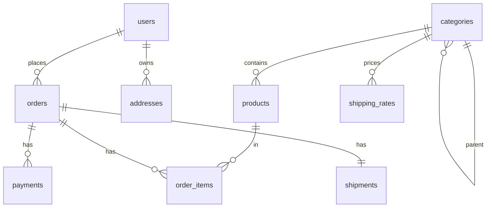

# ADR 002 — Database Schema

**Author:** SARA
**Status:** Accepted

## Overview
PostgreSQL 16. All money stored as `bigint` Rial (multiply by 1, divide by 10 for Toman display). All timestamps `timestamptz` UTC. All tables have `created_at` / `updated_at`.

## ERD

## Tables

### users
| Column | Type | Notes |
|---|---|---|
| id | uuid PK | gen_random_uuid() |
| phone | text UNIQUE | Iranian mobile, normalized to `09XXXXXXXXX` |
| email | text UNIQUE NULL | optional |
| name | text NULL | display name |
| role | enum | `buyer` / `company_admin` / `platform_admin` |
| password_hash | text NULL | Argon2id; NULL = OTP-only account |
| is_active | bool | default true |
| created_at, updated_at | timestamptz | |

**Indexes:** `phone` unique, `email` unique partial (where not null), `role` btree.

### categories
| Column | Type |
|---|---|
| id | uuid PK |
| slug | text UNIQUE |
| name_fa, name_en | text |
| parent_id | uuid FK NULL |
| sort_order | int |

### products
| Column | Type | Notes |
|---|---|---|
| id | uuid PK | |
| slug | text UNIQUE | |
| name_fa, name_en | text | |
| description_fa, description_en | text | |
| category_id | uuid FK | |
| wholesale_price_rial | bigint | per unit |
| moq | int | min order qty, ≥ 1 |
| quantity_step | int | default 1, e.g. 100 |
| weight_kg | numeric(10,3) | per unit |
| volume_cbm | numeric(10,4) | per unit |
| origin_country | char(2) | default 'CN' |
| images | jsonb | array of URLs |
| split_payment_ratio | numeric(3,2) NULL | 0.50 = 50% upfront; NULL falls back to category/global |
| is_active | bool | |

**Constraints:** `CHECK (moq >= 1)`, `CHECK (split_payment_ratio BETWEEN 0.40 AND 0.50)`.
**Indexes:** `slug` unique, `category_id`, `is_active`, GIN on `(name_fa, description_fa)` for FTS.

### orders
| Column | Type | Notes |
|---|---|---|
| id | uuid PK | |
| user_id | uuid FK | |
| status | enum | full state machine (ADR 003) |
| shipping_tier | enum | `turbo` / `normal` / `economy` |
| subtotal_rial | bigint | |
| shipping_cost_rial | bigint | |
| total_rial | bigint | subtotal + shipping |
| split_ratio | numeric(3,2) | locked at order creation |
| phase1_amount_rial | bigint | |
| phase2_amount_rial | bigint | |
| phase1_paid_at | timestamptz NULL | |
| phase2_paid_at | timestamptz NULL | |
| phase2_due_at | timestamptz NULL | set when arrived_in_iran |
| estimated_delivery_at | timestamptz | |
| actual_delivery_at | timestamptz NULL | |
| tracking_number | text NULL | |

**Constraints:** `CHECK (phase1_amount_rial + phase2_amount_rial = total_rial)`.
**Indexes:** `user_id`, `status`, `phase2_due_at` (for reminder cron).

### order_items
| Column | Type |
|---|---|
| id | uuid PK |
| order_id | uuid FK |
| product_id | uuid FK |
| quantity | int (≥ product.moq enforced at insert via service) |
| unit_price_rial | bigint (snapshot) |
| line_total_rial | bigint |

### payments
| Column | Type | Notes |
|---|---|---|
| id | uuid PK | |
| order_id | uuid FK | |
| phase | enum | `phase_1` / `phase_2` |
| amount_rial | bigint | |
| gateway | enum | `zarinpal` / `idpay` / `payir` |
| gateway_ref | text | provider transaction id |
| status | enum | `pending` / `success` / `failed` / `refunded` |
| paid_at | timestamptz NULL | |

**Indexes:** `order_id`, `(gateway, gateway_ref)` unique, `status`.

### shipments
| Column | Type |
|---|---|
| id | uuid PK |
| order_id | uuid FK UNIQUE |
| tier | enum (matches orders.shipping_tier) |
| current_status | enum (ADR 004) |
| status_history | jsonb (array of `{status, at, note}`) |
| eta_min_days, eta_max_days | int |
| carrier | text NULL |
| tracking_url | text NULL |

### shipping_rates
| Column | Type |
|---|---|
| id | uuid PK |
| tier | enum |
| category_id | uuid FK NULL (NULL = applies to all) |
| weight_min_kg, weight_max_kg | numeric |
| rate_per_kg_rial | bigint |
| base_cost_rial | bigint |
| eta_min_days, eta_max_days | int |
| is_active | bool |

**Indexes:** `(tier, category_id, weight_min_kg)`.

### addresses
| Column | Type |
|---|---|
| id | uuid PK |
| user_id | uuid FK |
| label | text |
| recipient_name, recipient_phone | text |
| province, city, postal_code | text |
| street, building, unit | text |
| is_default | bool |

## Migration strategy
- Drizzle Kit `generate` → review SQL → commit migration files.
- All migrations idempotent and reversible where possible.
- Production migrations run via `drizzle-kit migrate` in CI deploy step (not at app boot).
